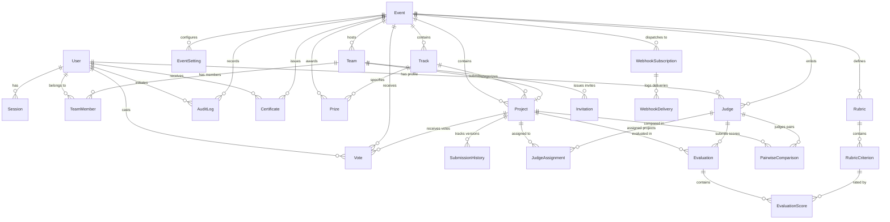

# DOGFOOD 2026 Data Model & Relational Database Schema

## 1. Complete Entity-Relationship Overview

---

## 2. Table Specifications

### 2.1 User & Session Management

#### `users`
| Column | Type | Constraints | Description |
|---|---|---|---|
| `id` | UUID | PK, default `gen_random_uuid()` | Unique user identifier |
| `email` | VARCHAR(255) | UNIQUE, NOT NULL | Account email address |
| `passwordHash` | VARCHAR(255) | NOT NULL | bcrypt hash (12 rounds) |
| `name` | VARCHAR(255) | NOT NULL | User's display name |
| `role` | VARCHAR(50) | NOT NULL, DEFAULT `'PARTICIPANT'` | System role: `ADMIN`, `ORGANIZER`, `JUDGE`, `PARTICIPANT` |
| `bio` | TEXT | NULL | Optional user biography |
| `avatarUrl` | VARCHAR(512) | NULL | Optional avatar image path |
| `isActive` | BOOLEAN | NOT NULL, DEFAULT `true` | Account activation flag |
| `createdAt` | TIMESTAMPTZ | NOT NULL, DEFAULT `NOW()` | Account creation timestamp |
| `updatedAt` | TIMESTAMPTZ | NOT NULL, DEFAULT `NOW()` | Last profile update timestamp |

*Indexes*: `idx_users_email (email)`, `idx_users_role (role)`

#### `sessions`
| Column | Type | Constraints | Description |
|---|---|---|---|
| `id` | UUID | PK, default `gen_random_uuid()` | Session record identifier |
| `userId` | UUID | FK -> `users(id)` ON DELETE CASCADE | Associated user account |
| `token` | VARCHAR(512) | UNIQUE, NOT NULL | Secure session token |
| `userAgent` | VARCHAR(512) | NULL | Browser User-Agent header |
| `ipAddress` | VARCHAR(45) | NULL | Client IPv4/IPv6 address |
| `expiresAt` | TIMESTAMPTZ | NOT NULL | Session expiry timestamp |
| `createdAt` | TIMESTAMPTZ | NOT NULL, DEFAULT `NOW()` | Session initiation timestamp |

*Indexes*: `idx_sessions_token (token)`, `idx_sessions_user_expires (userId, expiresAt)`

---

### 2.2 Events, Settings, Tracks & Prizes

#### `events`
| Column | Type | Constraints | Description |
|---|---|---|---|
| `id` | UUID | PK, default `gen_random_uuid()` | Event unique identifier |
| `slug` | VARCHAR(100) | UNIQUE, NOT NULL | URL-friendly unique identifier |
| `name` | VARCHAR(255) | NOT NULL | Official event title |
| `tagline` | VARCHAR(255) | NULL | Short event tagline |
| `description` | TEXT | NOT NULL | Comprehensive markdown description |
| `status` | VARCHAR(50) | NOT NULL, DEFAULT `'DRAFT'` | Status: `DRAFT`, `REGISTRATION_OPEN`, `SUBMISSION_OPEN`, `JUDGING_ACTIVE`, `RESULTS_PUBLISHED`, `ARCHIVED` |
| `registrationStartDate` | TIMESTAMPTZ | NOT NULL | Start of participant registration |
| `registrationEndDate` | TIMESTAMPTZ | NOT NULL | Participant registration deadline |
| `submissionStartDate` | TIMESTAMPTZ | NOT NULL | Start of project submission window |
| `submissionDeadline` | TIMESTAMPTZ | NOT NULL | Hard submission deadline |
| `judgingStartDate` | TIMESTAMPTZ | NOT NULL | Start of evaluation period |
| `judgingDeadline` | TIMESTAMPTZ | NOT NULL | Hard evaluation deadline |
| `resultsPublishedAt` | TIMESTAMPTZ | NULL | Timestamp when results were made public |
| `createdAt` | TIMESTAMPTZ | NOT NULL, DEFAULT `NOW()` | Creation timestamp |
| `updatedAt` | TIMESTAMPTZ | NOT NULL, DEFAULT `NOW()` | Last update timestamp |

*Indexes*: `idx_events_slug (slug)`, `idx_events_status (status)`

#### `event_settings`
| Column | Type | Constraints | Description |
|---|---|---|---|
| `id` | UUID | PK, default `gen_random_uuid()` | Settings identifier |
| `eventId` | UUID | UNIQUE, FK -> `events(id)` ON DELETE CASCADE | 1:1 relation to parent event |
| `minTeamSize` | INTEGER | NOT NULL, DEFAULT 1 | Minimum members per team |
| `maxTeamSize` | INTEGER | NOT NULL, DEFAULT 4 | Maximum members per team |
| `allowCommunityVoting`| BOOLEAN | NOT NULL, DEFAULT `true` | Enables public/community voting |
| `votingEligibility` | VARCHAR(50) | NOT NULL, DEFAULT `'VERIFIED_USERS'` | `PUBLIC`, `PARTICIPANTS_ONLY`, `VERIFIED_USERS` |
| `votesPerUser` | INTEGER | NOT NULL, DEFAULT 3 | Allowed votes per account |
| `hideResultsUntilPublished`| BOOLEAN| NOT NULL, DEFAULT `true` | Withholds vote counts and scores until publish |
| `randomizeGallery` | BOOLEAN | NOT NULL, DEFAULT `true` | Shuffles project order to eliminate position bias |
| `assignmentsPerProject` | INTEGER | NOT NULL, DEFAULT 3 | Target judge quorum per project |
| `defaultNormalization` | VARCHAR(50) | NOT NULL, DEFAULT `'Z_SCORE_FALLBACK'`| Default normalization algorithm |

#### `tracks`
| Column | Type | Constraints | Description |
|---|---|---|---|
| `id` | UUID | PK, default `gen_random_uuid()` | Track identifier |
| `eventId` | UUID | FK -> `events(id)` ON DELETE CASCADE | Parent event |
| `name` | VARCHAR(255) | NOT NULL | Track title (e.g., "AI & Machine Learning") |
| `description` | TEXT | NOT NULL | Track scope and criteria |
| `colorHex` | VARCHAR(10) | NOT NULL, DEFAULT `'#3b82f6'` | UI badge hex color code |

*Indexes*: `idx_tracks_event (eventId)`

#### `prizes`
| Column | Type | Constraints | Description |
|---|---|---|---|
| `id` | UUID | PK, default `gen_random_uuid()` | Prize identifier |
| `eventId` | UUID | FK -> `events(id)` ON DELETE CASCADE | Parent event |
| `trackId` | UUID | NULL, FK -> `tracks(id)` ON DELETE SET NULL | Optional track restriction |
| `name` | VARCHAR(255) | NOT NULL | Prize title (e.g., "1st Place Grand Prize") |
| `description` | TEXT | NOT NULL | Prize eligibility and details |
| `amount` | VARCHAR(100) | NULL | Cash/bounty value (e.g., "$10,000") |
| `rank` | INTEGER | NOT NULL, DEFAULT 1 | Display rank order |

*Indexes*: `idx_prizes_event (eventId)`

---

### 2.3 Teams & Invitations

#### `teams`
| Column | Type | Constraints | Description |
|---|---|---|---|
| `id` | UUID | PK, default `gen_random_uuid()` | Team identifier |
| `eventId` | UUID | FK -> `events(id)` ON DELETE CASCADE | Parent event |
| `name` | VARCHAR(255) | NOT NULL | Team name |
| `description` | TEXT | NULL | Team description / bio |
| `inviteCode` | VARCHAR(64) | UNIQUE, NOT NULL | Fast join invite code |
| `createdAt` | TIMESTAMPTZ | NOT NULL, DEFAULT `NOW()` | Team formation timestamp |

*Constraints*: `UNIQUE(eventId, name)`
*Indexes*: `idx_teams_event (eventId)`, `idx_teams_invite_code (inviteCode)`

#### `team_members`
| Column | Type | Constraints | Description |
|---|---|---|---|
| `id` | UUID | PK, default `gen_random_uuid()` | Membership identifier |
| `teamId` | UUID | FK -> `teams(id)` ON DELETE CASCADE | Parent team |
| `userId` | UUID | FK -> `users(id)` ON DELETE CASCADE | User member |
| `role` | VARCHAR(50) | NOT NULL, DEFAULT `'MEMBER'` | Team role: `LEADER`, `MEMBER` |
| `joinedAt` | TIMESTAMPTZ | NOT NULL, DEFAULT `NOW()` | Membership start timestamp |

*Constraints*: `UNIQUE(teamId, userId)`
*Indexes*: `idx_team_members_team (teamId)`, `idx_team_members_user (userId)`

#### `invitations`
| Column | Type | Constraints | Description |
|---|---|---|---|
| `id` | UUID | PK, default `gen_random_uuid()` | Invitation identifier |
| `teamId` | UUID | FK -> `teams(id)` ON DELETE CASCADE | Inviting team |
| `invitedEmail` | VARCHAR(255) | NOT NULL | Target recipient email |
| `token` | VARCHAR(128) | UNIQUE, NOT NULL | Cryptographic invite token |
| `status` | VARCHAR(50) | NOT NULL, DEFAULT `'PENDING'` | `PENDING`, `ACCEPTED`, `REJECTED`, `EXPIRED` |
| `expiresAt` | TIMESTAMPTZ | NOT NULL | Token expiry timestamp (e.g., 7 days) |
| `createdAt` | TIMESTAMPTZ | NOT NULL, DEFAULT `NOW()` | Issued timestamp |

*Indexes*: `idx_invitations_token (token)`, `idx_invitations_email (invitedEmail)`

---

### 2.4 Projects & Submissions

#### `projects`
| Column | Type | Constraints | Description |
|---|---|---|---|
| `id` | UUID | PK, default `gen_random_uuid()` | Project unique identifier |
| `eventId` | UUID | FK -> `events(id)` ON DELETE CASCADE | Associated event |
| `teamId` | UUID | UNIQUE, FK -> `teams(id)` ON DELETE CASCADE | Submitting team (1 project per team) |
| `trackId` | UUID | NULL, FK -> `tracks(id)` ON DELETE SET NULL | Selected track |
| `title` | VARCHAR(255) | NOT NULL | Project title |
| `tagline` | VARCHAR(255) | NULL | Short elevator pitch |
| `problemStatement` | TEXT | NOT NULL | Problem addressed |
| `solutionDescription`| TEXT | NOT NULL | Proposed solution and technical approach |
| `technologies` | TEXT[] | NOT NULL, DEFAULT `'{}'` | Array of technology tags |
| `repoUrl` | VARCHAR(512) | NULL | Git repository URL |
| `demoUrl` | VARCHAR(512) | NULL | Live deployment URL |
| `videoUrl` | VARCHAR(512) | NULL | Video pitch URL |
| `thumbnailUrl` | VARCHAR(512) | NULL | Project thumbnail image path |
| `customFields` | JSONB | NOT NULL, DEFAULT `'{}'` | Flexible custom questions |
| `status` | VARCHAR(50) | NOT NULL, DEFAULT `'DRAFT'` | `DRAFT`, `SUBMITTED`, `FINALIZED` |
| `submittedAt` | TIMESTAMPTZ | NULL | Timestamp of official submission |
| `rawScore` | FLOAT | NULL | Aggregated mean raw score |
| `normalizedScore` | FLOAT | NULL | Aggregated normalized score |
| `finalRank` | INTEGER | NULL | Official computed final rank |
| `createdAt` | TIMESTAMPTZ | NOT NULL, DEFAULT `NOW()` | Creation timestamp |
| `updatedAt` | TIMESTAMPTZ | NOT NULL, DEFAULT `NOW()` | Modification timestamp |

*Indexes*: `idx_projects_event_status (eventId, status)`, `idx_projects_team (teamId)`, `idx_projects_track (trackId)`

#### `submission_history`
| Column | Type | Constraints | Description |
|---|---|---|---|
| `id` | UUID | PK, default `gen_random_uuid()` | History record identifier |
| `projectId` | UUID | FK -> `projects(id)` ON DELETE CASCADE | Associated project |
| `changedByUserId`| UUID | NULL, FK -> `users(id)` ON DELETE SET NULL | User who triggered mutation |
| `status` | VARCHAR(50) | NOT NULL | Status at this snapshot |
| `snapshot` | JSONB | NOT NULL | Complete project JSON snapshot |
| `createdAt` | TIMESTAMPTZ | NOT NULL, DEFAULT `NOW()` | Timestamp of snapshot |

*Indexes*: `idx_submission_history_project (projectId)`

---

### 2.5 Judges, Rubrics, Assignments & Scoring

#### `judges`
| Column | Type | Constraints | Description |
|---|---|---|---|
| `id` | UUID | PK, default `gen_random_uuid()` | Judge profile identifier |
| `eventId` | UUID | FK -> `events(id)` ON DELETE CASCADE | Assigned event |
| `userId` | UUID | FK -> `users(id)` ON DELETE CASCADE | Associated user |
| `capacity` | INTEGER | NOT NULL, DEFAULT 10 | Max projects this judge can evaluate |
| `isActive` | BOOLEAN | NOT NULL, DEFAULT `true` | Judge availability status |

*Constraints*: `UNIQUE(eventId, userId)`
*Indexes*: `idx_judges_event_user (eventId, userId)`

#### `judge_assignments`
| Column | Type | Constraints | Description |
|---|---|---|---|
| `id` | UUID | PK, default `gen_random_uuid()` | Assignment identifier |
| `eventId` | UUID | FK -> `events(id)` ON DELETE CASCADE | Associated event |
| `judgeId` | UUID | FK -> `judges(id)` ON DELETE CASCADE | Assigned judge |
| `projectId` | UUID | FK -> `projects(id)` ON DELETE CASCADE | Assigned project |
| `isCompleted` | BOOLEAN | NOT NULL, DEFAULT `false` | Evaluation completion flag |
| `assignedAt` | TIMESTAMPTZ | NOT NULL, DEFAULT `NOW()` | Assignment creation timestamp |

*Constraints*: `UNIQUE(judgeId, projectId)`
*Indexes*: `idx_judge_assignments_judge (judgeId)`, `idx_judge_assignments_project (projectId)`

#### `rubrics`
| Column | Type | Constraints | Description |
|---|---|---|---|
| `id` | UUID | PK, default `gen_random_uuid()` | Rubric identifier |
| `eventId` | UUID | UNIQUE, FK -> `events(id)` ON DELETE CASCADE | Event association (1 rubric per event) |
| `name` | VARCHAR(255) | NOT NULL | Rubric title |
| `description` | TEXT | NULL | Scoring guidelines and instructions |

#### `rubric_criteria`
| Column | Type | Constraints | Description |
|---|---|---|---|
| `id` | UUID | PK, default `gen_random_uuid()` | Criterion identifier |
| `rubricId` | UUID | FK -> `rubrics(id)` ON DELETE CASCADE | Parent rubric |
| `title` | VARCHAR(255) | NOT NULL | Criterion title (e.g. "Innovation") |
| `description` | TEXT | NOT NULL | Evaluation guideline for this criterion |
| `weight` | FLOAT | NOT NULL | Normalized weight (e.g. 0.30 for 30%) |
| `maxScore` | INTEGER | NOT NULL, DEFAULT 10 | Max points achievable |
| `orderIndex` | INTEGER | NOT NULL, DEFAULT 0 | Display sequence order |

*Indexes*: `idx_rubric_criteria_rubric (rubricId)`

#### `evaluations`
| Column | Type | Constraints | Description |
|---|---|---|---|
| `id` | UUID | PK, default `gen_random_uuid()` | Evaluation identifier |
| `eventId` | UUID | FK -> `events(id)` ON DELETE CASCADE | Associated event |
| `judgeId` | UUID | FK -> `judges(id)` ON DELETE CASCADE | Evaluating judge |
| `projectId` | UUID | FK -> `projects(id)` ON DELETE CASCADE | Evaluated project |
| `isDraft` | BOOLEAN | NOT NULL, DEFAULT `false` | Draft vs finalized score flag |
| `weightedTotal` | FLOAT | NOT NULL, DEFAULT 0 | Computed weighted score (0-100) |
| `feedback` | TEXT | NULL | Qualitative judge feedback |
| `createdAt` | TIMESTAMPTZ | NOT NULL, DEFAULT `NOW()` | Score submission timestamp |
| `updatedAt` | TIMESTAMPTZ | NOT NULL, DEFAULT `NOW()` | Last modification timestamp |

*Constraints*: `UNIQUE(judgeId, projectId)`
*Indexes*: `idx_evaluations_judge_project (judgeId, projectId)`, `idx_evaluations_project (projectId)`

#### `evaluation_scores`
| Column | Type | Constraints | Description |
|---|---|---|---|
| `id` | UUID | PK, default `gen_random_uuid()` | Criterion score record identifier |
| `evaluationId` | UUID | FK -> `evaluations(id)` ON DELETE CASCADE | Parent evaluation |
| `criterionId` | UUID | FK -> `rubric_criteria(id)` ON DELETE CASCADE | Rated criterion |
| `score` | FLOAT | NOT NULL | Points awarded (between 0 and `maxScore`) |

*Constraints*: `UNIQUE(evaluationId, criterionId)`
*Indexes*: `idx_evaluation_scores_eval (evaluationId)`

---

### 2.6 Pairwise Comparisons, Community Votes, Audit Logs, Webhooks & Certificates

#### `pairwise_comparisons`
| Column | Type | Constraints | Description |
|---|---|---|---|
| `id` | UUID | PK, default `gen_random_uuid()` | Comparison identifier |
| `eventId` | UUID | FK -> `events(id)` ON DELETE CASCADE | Associated event |
| `judgeId` | UUID | FK -> `judges(id)` ON DELETE CASCADE | Evaluating judge |
| `projectAId` | UUID | FK -> `projects(id)` ON DELETE CASCADE | First project in pair |
| `projectBId` | UUID | FK -> `projects(id)` ON DELETE CASCADE | Second project in pair |
| `winnerProjectId`| UUID | NULL, FK -> `projects(id)` ON DELETE CASCADE | Winner (`NULL` indicates exact tie) |
| `notes` | TEXT | NULL | Judge comparison commentary |
| `createdAt` | TIMESTAMPTZ | NOT NULL, DEFAULT `NOW()` | Comparison timestamp |

*Indexes*: `idx_pairwise_event (eventId)`, `idx_pairwise_judge (judgeId)`

#### `votes`
| Column | Type | Constraints | Description |
|---|---|---|---|
| `id` | UUID | PK, default `gen_random_uuid()` | Vote identifier |
| `eventId` | UUID | FK -> `events(id)` ON DELETE CASCADE | Target event |
| `projectId` | UUID | FK -> `projects(id)` ON DELETE CASCADE | Voted project |
| `userId` | UUID | NULL, FK -> `users(id)` ON DELETE SET NULL | Authenticated voter account |
| `ipAddress` | VARCHAR(45) | NOT NULL | Client IP for abuse tracking |
| `userAgent` | VARCHAR(512) | NULL | Client browser fingerprint |
| `createdAt` | TIMESTAMPTZ | NOT NULL, DEFAULT `NOW()` | Vote timestamp |

*Constraints*: `UNIQUE(eventId, userId, projectId)`
*Indexes*: `idx_votes_event_project (eventId, projectId)`, `idx_votes_user (userId)`

#### `audit_logs`
| Column | Type | Constraints | Description |
|---|---|---|---|
| `id` | UUID | PK, default `gen_random_uuid()` | Audit log identifier |
| `eventId` | UUID | NULL, FK -> `events(id)` ON DELETE CASCADE | Context event |
| `userId` | UUID | NULL, FK -> `users(id)` ON DELETE SET NULL | Actor user identifier |
| `action` | VARCHAR(100) | NOT NULL | Action string (e.g., `SCORE_SUBMITTED`) |
| `entityType` | VARCHAR(100) | NOT NULL | Target entity type (e.g., `Evaluation`) |
| `entityId` | VARCHAR(255) | NULL | Target entity ID |
| `ipAddress` | VARCHAR(45) | NULL | Request source IP |
| `payload` | JSONB | NOT NULL, DEFAULT `'{}'` | Complete audit diff & metadata |
| `createdAt` | TIMESTAMPTZ | NOT NULL, DEFAULT `NOW()` | Immutable timestamp |

*Indexes*: `idx_audit_logs_event_created (eventId, createdAt)`, `idx_audit_logs_action (action)`

#### `certificates`
| Column | Type | Constraints | Description |
|---|---|---|---|
| `id` | UUID | PK, default `gen_random_uuid()` | Certificate identifier |
| `eventId` | UUID | FK -> `events(id)` ON DELETE CASCADE | Issuing event |
| `userId` | UUID | FK -> `users(id)` ON DELETE CASCADE | Recipient user |
| `type` | VARCHAR(50) | NOT NULL | `PARTICIPANT`, `JUDGE`, `WINNER`, `ORGANIZER` |
| `title` | VARCHAR(255) | NOT NULL | Certificate title |
| `verificationCode` | VARCHAR(64) | UNIQUE, NOT NULL | Public verification identifier |
| `signature` | VARCHAR(512) | NOT NULL | HMAC-SHA256 signature payload |
| `issuedAt` | TIMESTAMPTZ | NOT NULL, DEFAULT `NOW()` | Issuance timestamp |

*Indexes*: `idx_certificates_verification (verificationCode)`

#### `webhook_subscriptions` & `webhook_deliveries`
- **`webhook_subscriptions`**: `id` (UUID PK), `eventId` (FK), `targetUrl` (VARCHAR), `secret` (VARCHAR), `events` (TEXT[]), `isActive` (BOOLEAN).
- **`webhook_deliveries`**: `id` (UUID PK), `subscriptionId` (FK), `event` (VARCHAR), `payload` (JSONB), `statusCode` (INTEGER), `attempts` (INTEGER), `deliveredAt` (TIMESTAMPTZ).
