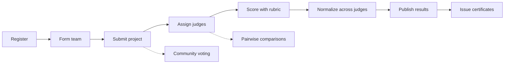
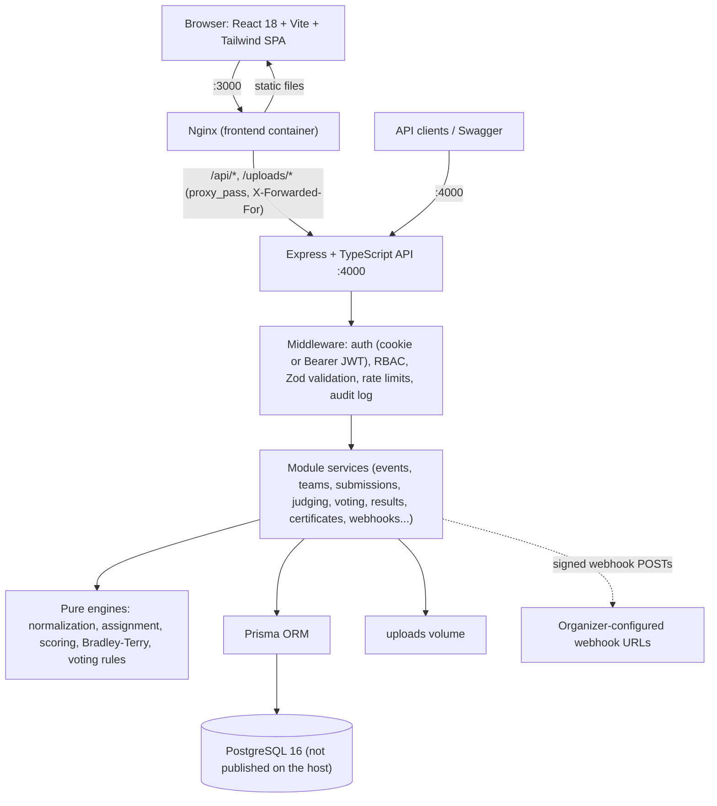

# DOGFOOD 2026: Self-Hosted Hackathon Submission & Judging Platform

[](LICENSE)
[](docker-compose.yml)
[](.github/workflows/ci.yml)

**DOGFOOD** is a self-hostable hackathon platform: registration, teams, project submissions, a public gallery,
judge assignment, rubric scoring, cross-judge score normalization, pairwise ranking, community voting, results,
certificates, CSV exports and webhooks. It runs entirely from `docker compose up` with no third-party SaaS
accounts; the only outbound traffic is to webhook URLs an organizer configures.

**Flow:** Registration → Team formation → Submission → Judge assignment → Scoring → Normalization → Results → Certificates



---

## 1. Quick start

```bash
docker compose up --build
```

Then open **http://localhost:3000** and sign in with a seeded account (password `Dogfood2026!`, see below).

No `.env` file is needed. On first start the backend:

1. applies the committed Prisma migrations (`prisma migrate deploy`),
2. generates random `JWT_SECRET` / `COOKIE_SECRET` values and stores them in the `backend_secrets` volume
   (so sessions and certificate signatures survive restarts),
3. seeds the demo event and accounts **only if the database is empty**. Existing data is never modified or deleted,
   so `docker compose restart` or `docker compose up` again keeps everything you created.

| URL | What |
|---|---|
| http://localhost:3000 | Web UI (Nginx serves the React build and proxies `/api` and `/uploads` to the backend) |
| http://localhost:3000/api/docs | Swagger UI for the OpenAPI spec (also at http://localhost:4000/api/docs) |
| http://localhost:4000/api/health | Backend health check (port 4000 stays published for direct API access) |

Other options:

- `./setup.sh` (Linux/macOS/WSL) or `setup.bat` (Windows) create a `.env` with random secrets from
  [`.env.example`](.env.example) and start the stack. They never delete volumes.
- Full reset: `docker compose down -v` (removes the database, uploads and generated secrets).
- Disable demo data: set `SEED_DEMO_DATA=false` (in `.env` or the environment).

<details>
<summary>Local development without Docker</summary>

```bash
# PostgreSQL 16 must be reachable at DATABASE_URL (see .env.example)
cd backend
npm ci
npx prisma migrate deploy
npm run prisma:seed          # tsx src/seed/demo-seed.ts
npm run dev                  # http://localhost:4000

cd frontend
npm ci
npm run dev                  # http://localhost:3000 (Vite proxies /api and /uploads to :4000)
```
</details>

> **Upgrading an older checkout:** earlier versions created the schema with `prisma db push`. `migrate deploy`
> refuses to run on such a database; reset it with `docker compose down -v` (this deletes its data).

## 2. Seeded accounts

Password for every account: **`Dogfood2026!`**. The login page also has one-click buttons for the organizer,
harsh judge, admin and a participant.

| Role | Email | In the demo event |
|---|---|---|
| Admin | `admin@dogfood.local` | Everything an organizer can do, plus user role management (API) |
| Organizer | `organizer@dogfood.local` | Organizer Hub: assignment, normalization, publishing, exports, certificates, webhooks, bulk import, audit trail |
| Judge (harsh) | `judge.harsh@dogfood.local` | 5 assigned projects, **PulseMesh still unscored**, the one to grade live |
| Judge (lenient) | `judge.lenient@dogfood.local` | 5 assigned projects, all scored with high marks |
| Judge (balanced) | `judge.balanced@dogfood.local` | 4 assigned projects, all scored |
| Judge (specialist) | `judge.specialist@dogfood.local` | Also a member of team Synthetix Audio, so never assigned their own project (conflict of interest) |
| Participant | `alice@dogfood.local` | Leader of *Neural Nexus* (project *Aegis AI*, submitted); `bob@dogfood.local` is a member |
| Participant | `carol@dogfood.local` | Leader of *Quantum Leap* (project *HyperGraph*); `dave@dogfood.local` is a member |
| Participant | `zack@dogfood.local` | Leader of *StealthSec*, whose project is an unsubmitted **draft** (hidden from everyone else) |

Other seeded participants: `eve@`, `frank@`, `grace@`, `liam@dogfood.local` (one team each). The demo event
`dogfood-2026` is in `JUDGING_ACTIVE` with submission and judging windows open relative to the seed time, 6 submitted
projects, 1 draft, 16 finalized evaluations and results **not yet published**.

New sign-ups are always participants. Organizers add judges to an event ("add judge" API), and admins grant
organizer access (role API or bulk import).

[`END_TO_END_EVALUATION_GUIDE.md`](END_TO_END_EVALUATION_GUIDE.md) walks through the whole demo role by role;
[`DEMO-SCRIPT.md`](DEMO-SCRIPT.md) is a condensed 5-minute version.

## 3. Architecture



- **Three containers** (`docker-compose.yml`): `postgres` (internal only), `backend` (port 4000), `frontend`
  (Nginx on port 3000). The browser only talks to `:3000`; the SPA is built with `VITE_API_URL=/api`, so the app
  works from any hostname or another machine on the network.
- **Backend** (`backend/src`): an Express modular monolith. Each folder in `backend/src/modules` has routes,
  controller and service; the math lives in dependency-free engine files
  ([normalization.engine.ts](backend/src/modules/normalization/normalization.engine.ts),
  [assignment.engine.ts](backend/src/modules/assignments/assignment.engine.ts),
  [scoring.engine.ts](backend/src/modules/scoring/scoring.engine.ts),
  [bradley-terry.ts](backend/src/modules/pairwise/bradley-terry.ts),
  [voting.rules.ts](backend/src/modules/voting/voting.rules.ts)) that the services call and the unit tests import.
- **Express `trust proxy`** is set from `TRUST_PROXY` (Compose: loopback + private ranges), so rate limits, vote
  IP tracking and the audit log see the real client address rather than the Nginx container.
- **API**: 70 operations under `/api`, all described in [backend/docs/openapi.yaml](backend/docs/openapi.yaml). A test
  fails if a route is added without documenting it. [API-SPEC.md](API-SPEC.md) is a shorter overview.

More detail: [ARCHITECTURE.md](ARCHITECTURE.md), [DATA-MODEL.md](DATA-MODEL.md), [JUDGING.md](JUDGING.md).

## 4. How judging works

**Assignment** (`POST /api/events/:id/judges/assign/auto`). For each of `targetPerProject` rounds (default: the
event's `assignmentsPerProject`, 3), every submitted project gets one more judge: the least-loaded judge who is not
on the project's team, not already assigned to it and under capacity. Ties are broken with a seeded Mulberry32
PRNG, so the same seed and data reproduce the same assignment. Loads are near-even (greedy; within ±2 of each other
in our randomized tests) rather than perfectly balanced. Projects that could not get enough judges are reported.

**Scoring.** A rubric has weighted criteria (fractions, or percentages that must total 100%). A judge's total is
`Σ (score / maxScore) × weight × 100`, 0-100. Judges can only score projects assigned to them, inside the judging
window, never their own team's, and only non-draft projects. They can only read their own evaluations.

**Normalization** (`POST /api/events/:id/judging/normalize`) removes judge leniency/harshness:

- `Z_SCORE_FALLBACK` (default): each judge's totals become z-scores and are mapped to mean 70 / sd 15, with z clamped
  to [-3, 3] and the result to [0, 100]. Judges with fewer than 3 evaluations are shrunk toward the global mean and
  variance (empirical-Bayes prior, k = 3); a judge who gave identical scores uses the global standard deviation.
- `MIN_MAX`: each judge's range is rescaled to [0, 100] (global range if the judge's range is zero).

Projects are ranked by mean normalized score, then (ties) highest score on the highest-weighted criterion, then
lowest disagreement between judges, then earliest submission. Details and formulas: [JUDGING.md](JUDGING.md).

**Pairwise ranking.** Judges can also compare two random projects; `POST /api/events/:id/pairwise/compute` fits a
Bradley-Terry model with the MM algorithm and reports whether it converged.

## 5. Security

Summary of what is enforced (details in [SECURITY.md](SECURITY.md) and [THREAT-MODEL.md](THREAT-MODEL.md)):

- **Secrets**: no hardcoded secrets; production refuses missing, short (< 32 chars) or known placeholder values.
  Docker generates random ones on first boot.
- **Auth**: bcrypt passwords; HTTP-only `SameSite=Lax` session cookie (Secure over HTTPS) backed by a revocable
  session row; self-registration can only create participants.
- **Authorization**: role checks on every route plus ownership/assignment checks in the services (see
  [docs/ROLE-PERMISSION-MATRIX.md](docs/ROLE-PERMISSION-MATRIX.md)).
- **Uploads**: type detected from file content (JPEG/PNG/WEBP/GIF/PDF only, SVG rejected), server-chosen file name
  and extension, served with `nosniff`, a sandbox CSP, and as a download unless it is an image.
- **Input validation**: Zod schemas on every body-consuming route (strict allowlists on update payloads) and on
  pagination/search query parameters; user-supplied links must be `http(s)`.
- **Voting integrity**: per-voter limits checked and written in one transaction under an advisory lock; unique
  indexes block duplicate votes, including a partial index for anonymous (per-IP) votes.
- **CSV exports**: cells starting with `=`, `+`, `-`, `@`, tab or CR are neutralized against formula injection.
- **Webhooks**: HMAC-SHA256 signed; private, loopback and cloud-metadata targets rejected; redirects not followed.
- **Bulk import**: can never create admins; organizers can only import participants and judges.

## 6. Testing

```bash
cd backend
npm test                        # unit + security + HTTP tests, no database needed

docker compose -f ../docker-compose.test.yml up -d    # throwaway PostgreSQL on 127.0.0.1:5433
npm run test:integration        # real-database tests (resets the *_test database each run)
```

- **`npm test`** runs `tests/unit` (the pure engines, imported from `src/`), `tests/security` (authorization and
  business-rule bypass attempts against the real services with a mocked Prisma client, upload hardening through the
  real app) and `tests/api` (HTTP tests that never touch the database, including an OpenAPI coverage check).
- **`npm run test:integration`** runs `tests/integration` against PostgreSQL. [platform-flow.test.ts](backend/tests/integration/platform-flow.test.ts) drives the full
  flow over HTTP: register → team → submit → rubric and judges → auto-assign → score → normalize → publish → webhook
  delivery logged → voting rules (including concurrent votes) → certificate generation and verification (including
  tamper detection), plus deadline enforcement, privileged-role registration attempts and persistence across a new
  `PrismaClient`. It refuses to run against a database whose name does not end in `_test`.
- **CI** ([.github/workflows/ci.yml](.github/workflows/ci.yml)) builds both apps, runs both suites (with a
  PostgreSQL service), checks that every file path mentioned in the docs exists
  ([scripts/check-doc-paths.mjs](scripts/check-doc-paths.mjs)), builds the Docker images and smoke-tests the
  Compose stack including a restart.

## 7. Configuration

All variables are optional under Docker; see [`.env.example`](.env.example).

| Variable | Default (Compose) | Purpose |
|---|---|---|
| `POSTGRES_USER` / `POSTGRES_PASSWORD` / `POSTGRES_DB` | `postgres` / `postgres` / `dogfood` | Database; `DATABASE_URL` is derived from these |
| `JWT_SECRET`, `COOKIE_SECRET` | generated on first boot | Set to override (≥ 32 random characters) |
| `CORS_ORIGIN` | `http://localhost:3000` | Extra allowed origins for direct API use (comma-separated) |
| `TRUST_PROXY` | `loopback, linklocal, uniquelocal` | Express trust-proxy setting |
| `COOKIE_SECURE` | `auto` | `auto` = Secure only for HTTPS requests; or `true` / `false` |
| `SEED_DEMO_DATA` | `true` | Seed the demo event when the database is empty |
| `VITE_API_URL` | `/api` | Build-time API base URL for the frontend |

To re-expose PostgreSQL on the host for local tools, uncomment the `ports` block of the `postgres` service in
`docker-compose.yml`. For HTTPS / a custom domain see [docs/CUSTOM_DOMAIN_SETUP.md](docs/CUSTOM_DOMAIN_SETUP.md).

## 8. Known limitations

- **Organizers are global.** Any organizer can manage any event; there is no per-event ownership.
- **Some features are API-only** (no UI yet): rubric editing, adding judges, manual assignment, track/prize
  management, user role management, project finalization, pairwise ranking computation and vote statistics. All are
  documented in Swagger.
- **Certificates** are signed database records verified on `/verify`; no PDF/image is generated. They are signed with
  `JWT_SECRET`, so changing that secret invalidates existing certificates.
- **Webhooks** are delivered once (no retry queue) and are auto-disabled after 5 consecutive failures. The SSRF check
  runs on the URL at registration time; DNS names that later resolve to private addresses are not re-checked.
- **Event settings** `randomizeGallery` and `hideResultsUntilPublished` are stored but have no effect: the gallery sort
  is chosen by the viewer, and results are always hidden from non-staff until published.
- **Team invitations by email** return a token (shown to the leader) rather than sending an email, and the `inviteUrl`
  in the API response has no matching page. In the UI, members join with the team invite code shown in the Team Hub
  (the token can be used via `POST /api/teams/join`).
- **Rate limiting** is in-memory (per backend process). Clients that reach port 4000 directly from a private network
  can set `X-Forwarded-For`; restrict port 4000 in production if that matters.
- **Anonymous voting** (eligibility `PUBLIC`) is limited per IP address, which is weak against voters on shared or
  changing IPs.

## License

MIT, see [LICENSE](LICENSE).
