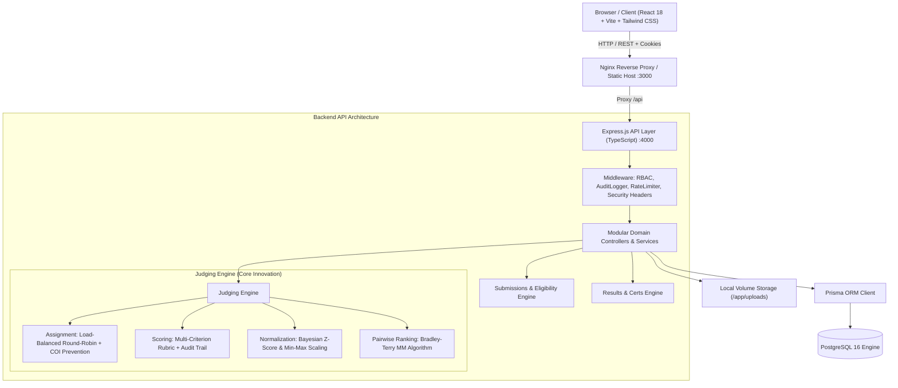

# DOGFOOD 2026: Open-Source Hackathon Submission & Judging Platform

[](LICENSE)
[](docker-compose.yml)
[-success)](backend/tests/)
[](ARCHITECTURE.md)

### What is Dogfood?
**Dogfood** is a completely self-hostable, zero-cloud-dependency hackathon operating system and judging platform. Built for university hackathons, corporate internal sprints, and major open-source competitions, Dogfood runs end-to-end without requiring third-party SaaS accounts, credit cards, or external cloud infrastructure:
\\text{Registration} \longrightarrow \text{Team Formation} \longrightarrow \text{Submissions} \longrightarrow \text{Eligibility} \longrightarrow \text{Judge Assignment} \longrightarrow \text{Scoring} \longrightarrow \text{Normalization} \longrightarrow \text{Results} \longrightarrow \text{Certificates} \longrightarrow \\text{Archiving}

### Why is it structured this way?
1. **Modular Monolith over Microservices**: Hackathons are time-compressed, mission-critical events where distributed failure modes (network partitions, out-of-order event buses, eventual consistency delays) are unacceptable. Dogfood implements a high-throughput Express/TypeScript modular monolith backed by PostgreSQL 16. This architecture enables atomic, ACID-compliant database transactions (prisma.) across project submissions, score submissions, and audit logging.
2. **Server-Side Invariants & Zero Trust**: Client-side UI validations serve solely as user experience aids. Every business invariant—such as strict submission deadlines, registration windows, team size boundaries, track isolation, and conflict-of-interest prevention—is strictly enforced in the API layer with typed error codes. Bypassing the frontend via direct curl or Postman requests is rejected server-side.
3. **Dedicated, Bias-Resistant Judging Engine**: Naive arithmetic averaging is mathematically flawed: teams evaluated by lenient judges gain an unfair advantage, while teams evaluated by strict judges are unfairly penalized. Dogfood’s core innovation is an automated judging engine featuring:
   - **Conflict-Free Load Balancing**: Deterministic pseudo-random assignment matching projects to judges while strictly preventing self-scoring.
   - **Empirical Bayes Z-Score Normalization**: Regularizes individual judge scoring distributions against the global population prior to eliminate leniency and scale-compression bias without small-sample distortion.
   - **Bradley-Terry Pairwise Ranking**: Minorization-Maximization (MM) pairwise comparisons for head-to-head project evaluation.
   - **Immutable Audit Trail**: Append-only logging of every score submission, update, and organizer override.
4. **Decoupled Frontend with Reverse-Proxy Security**: The React 18 single-page application is built into static assets and served via Nginx. Nginx handles client caching and proxies /api requests to Express, stripping internal headers and shielding backend application logic.

## Architecture Overview



---

## 1. One-Command Setup

The entire stack — PostgreSQL, Express API backend, Prisma migrations, fixture seeding, and Nginx/React frontend — boots with **zero manual configuration editing**.

### Option A: Direct Docker Compose (Universal)
```bash
docker compose up --build
```

### Option B: Quick Setup Script (Linux / macOS / WSL)
```bash
chmod +x ./setup.sh
./setup.sh
```

### Option C: Windows Batch Script
```cmd
setup.bat
```

### Option D: Local Development (Without Docker)
```bash
# Terminal 1: Backend
cd backend
npm install
npx prisma generate
npx prisma db push
npx tsx prisma/seed.ts
npm run dev

# Terminal 2: Frontend
cd frontend
npm install
npm run dev
```

The stack is available at:
- **Frontend Web UI**: [http://localhost:3000](http://localhost:3000)
- **Backend REST API**: [http://localhost:4000/api](http://localhost:4000/api)
- **Interactive Swagger Docs**: [http://localhost:4000/api/docs](http://localhost:4000/api/docs)
- **Health Check**: [http://localhost:4000/api/health](http://localhost:4000/api/health)

---

## 2. Seed Accounts & Credentials

The database seeds with realistic data including multiple judges with distinct grading personalities (harsh vs. lenient) to demonstrate score normalization.

**Standard Password for All Accounts:** `Dogfood2026!`

| Role | Email | Capabilities & Scenarios |
|---|---|---|
| **Admin** | `admin@dogfood.local` | Platform-wide control, role management, system health, audit logs |
| **Organizer** | `organizer@dogfood.local` | Event lifecycle, deadlines, judge assignment, normalization, publishing, exports |
| **Harsh Judge** | `judge.harsh@dogfood.local` | Strict evaluator ($\mu \approx 62$); demonstrates upward normalization shift |
| **Lenient Judge** | `judge.lenient@dogfood.local` | Generous evaluator ($\mu \approx 89$); demonstrates downward normalization shift |
| **Balanced Judge** | `judge.balanced@dogfood.local` | Centered evaluator ($\mu \approx 74, \sigma \approx 12$) |
| **Participant (Lead)** | `lead.alice@dogfood.local` | Team Captain of "Neural Nexus" (Project: *Aegis AI*) |
| **Participant (Member)**| `bob@dogfood.local` | Team member of "Neural Nexus" |
| **Participant (Lead 2)**| `lead.carol@dogfood.local` | Team Captain of "Quantum Leap" (Project: *HyperGraph*) |

---

## 3. How the Judging Engine Works

### A. Conflict-Free Load-Balanced Judge Assignment

The judge assignment algorithm ([assignment.service.ts](file:///c:/Users/RUTUJA%20PATOLE/Dog_Food/backend/src/modules/assignments/assignment.service.ts)) solves the multi-round bipartite project assignment problem:

1. **Conflict of Interest (COI) Invariant**:
   Before assignments begin, the system builds an immutable conflict graph:
   $$\text{COI}(P) = \{ J \mid \text{User}(J) \in \text{TeamMembers}(\text{Team}(P)) \}$$
   Judges are strictly prohibited from evaluating their own team's submissions, both in automated assignment and manual assignment.
2. **Greedy Load-Balanced Allocation**:
   At each round $r \in [1, \text{targetPerProject}]$, candidate judges who are not conflicted, have not yet been assigned to project $P$, and have remaining capacity ($\text{load}_j < \text{capacity}_j$) are ranked by current assigned workload ascending.
3. **Deterministic PRNG Tie-Breaking**:
   Ties among judges with identical workloads are resolved via a seeded 32-bit **Mulberry32 PRNG**. This guarantees that given the same seed (e.g., `seed = 42`), the assignment schedule is 100% reproducible and verifiable by third-party auditors.
4. **Coverage Diagnostics**:
   The engine logs coverage summaries, explicitly highlighting any projects that received fewer assignments than target due to judge pool exhaustion or dense conflicts.

### B. Cross-Judge Score Normalization

#### Why Raw Scores Fail
In any hackathon where projects are scored by different judges, raw arithmetic averages are mathematically unfair:
- **Location Bias (Leniency vs. Harshness)**: A team evaluated by a lenient judge (averaging 90) gains an unearned advantage over a team evaluated by a harsh judge (averaging 65).
- **Scale Bias (Variance Differences)**: A judge who uses the entire $[0, 100]$ range has 10x more mathematical influence on raw averages than a judge who clusters all scores in $[75, 85]$.

#### The Normalization Solution
The platform supports two configurable normalization strategies in [normalization.service.ts](file:///c:/Users/RUTUJA%20PATOLE/Dog_Food/backend/src/modules/normalization/normalization.service.ts):

#### Method 1: Z-Score with Empirical Bayes Shrinkage (`Z_SCORE_FALLBACK` — Default)
Each judge $j$'s scores are standardized into standard deviation units $z$:
$$z_{ij} = \frac{x_{ij} - \mu_j^*}{\sigma_j^*}$$
and mapped to a standardized scale ($\mu_0 = 70, \sigma_0 = 15$):
$$S_{\text{norm}} = \text{clamp}\left(70 + 15 \times \text{clamp}(z, -3.0, 3.0),\, 0,\, 100\right)$$

**Bayesian Shrinkage for Small Sample Sizes ($N_j < 3$):**
When a judge evaluates only 1 or 2 projects, sample variance $s_j^2 = \frac{1}{N-1}\sum(x - \bar{x})^2$ is undefined ($N-1=0$) or has massive error. We apply an Empirical Bayes prior with pseudo-observations ($k = 3$):
$$\mu_j^* = \frac{N_j \bar{x}_j + k \mu_{\text{global}}}{N_j + k}$$
$$\sigma_j^{*2} = \frac{(N_j - 1)s_j^2 + k \sigma_{\text{global}}^2 + \frac{N_j k}{N_j + k}(\bar{x}_j - \mu_{\text{global}})^2}{N_j + k - 1}$$
This shrinks under-sampled judges smoothly toward the global hackathon population mean.

**Zero-Variance Fallback:**
If a judge awards identical scores to all assigned projects ($s_j = 0$), the engine uses $\sigma_{\text{global}}$ to avoid division-by-zero.

#### Method 2: Min-Max Feature Scaling (`MIN_MAX`)
Linearly rescales each judge's evaluations into $[0, 100]$ based on their observed minimum and maximum:
$$S_{\text{norm}} = \frac{x - \min_j}{\max_j - \min_j} \times 100$$
If $\max_j = \min_j$, the engine falls back to the global hackathon score range.

#### 4-Tier Deterministic Tie-Breaking Hierarchy
When projects finish with identical normalized scores:
1. **Tier 1**: Highest Normalized Score ($S_{\text{norm}}$)
2. **Tier 2**: Highest Core Criterion Score (score on the rubric criterion with the highest weight)
3. **Tier 3**: Lowest Judge Score Dispersion ($\sigma_{\text{eval}}$ — rewards consensus over polarized controversy)
4. **Tier 4**: Earliest Submission Timestamp (rewards prompt project submission)

### C. Append-Only Scoring Audit Trail
Every evaluation creation, edit, and organizer override is recorded in an immutable, append-only `AuditLog` table within the database transaction:
- Timestamp & Scorer User ID
- Project ID, Event ID, and Judge ID
- Action classification: `EVALUATION_CREATED`, `EVALUATION_UPDATED`, or `SCORE_OVERRIDE`
- Previous vs. New Weighted Total & Complete Criterion Score Breakdown

---

## 4. Backend Rule Enforcement

All business rules are enforced server-side in the Express API and service layer:

| Rule Category | Enforced Server-Side Behavior |
|---|---|
| **Submission Deadline** | Direct API calls after `submissionDeadline` return `400 DEADLINE_EXCEEDED`. |
| **Submission Start Date** | Direct API calls before `submissionStartDate` return `400 SUBMISSION_NOT_STARTED`. |
| **Team Size Bounds** | Submitting with fewer than `minTeamSize` returns `400 TEAM_SIZE_TOO_SMALL`. Exceeding `maxTeamSize` returns `400 TEAM_SIZE_TOO_LARGE`. |
| **Track Scope** | Submitting with a track belonging to a foreign event returns `400 INVALID_TRACK`. |
| **Registration Window** | Team creation or joining outside `[registrationStartDate, registrationEndDate]` returns `400 REGISTRATION_NOT_STARTED` / `REGISTRATION_CLOSED`. |
| **Judge Access Scope** | A judge attempting to score an unassigned project returns `403 NOT_ASSIGNED`. |
| **Draft Protection** | Judges attempting to evaluate unsubmitted `DRAFT` projects return `400 PROJECT_NOT_SUBMITTED`. |
| **Conflict of Interest** | A judge scoring their own team's submission returns `403 SELF_EVALUATION_FORBIDDEN`. |
| **Participant Score Isolation** | Participants querying `/api/events/:id/results` before publication return `403 RESULTS_NOT_PUBLISHED`. |
| **Draft Privacy** | Participants querying another team's draft project return `403 FORBIDDEN`. |
| **Role-Based Access Control** | Non-privileged users accessing `/api/admin/*`, `/api/events/:id/judges/assign/*`, or `/api/events/:id/export/*` return `403 FORBIDDEN`. |

---

## 5. Automated Test Suite

The platform includes **101 automated tests** covering unit math, security hardening, rule bypasses, and role isolation:

```bash
cd backend
npm test
```

### Test Coverage Highlights:
- **`tests/security/business-rule-bypass.test.ts` (19 tests)**: Direct API simulation attempting to bypass deadlines, eligibility limits, track bounds, judge assignments, self-evaluation bans, draft privacy, and results embargo.
- **`tests/security/rbac.test.ts` (3 tests)**: Role isolation across participant, judge, and organizer/admin roles.
- **`tests/unit/scoring-validation.test.ts` (12 tests)**: Duplicate criterion rejection, missing criteria detection, out-of-bounds score clamping, and NaN/Infinity guards.
- **`tests/unit/normalization.test.ts` (7 tests)**: Z-score math, Bayesian prior shrinkage, zero-variance handling, outlier clamping ($\pm 3\sigma$), Min-Max scaling, and 4-tier tie-breaking.
- **`tests/unit/assignment.test.ts` (3 tests)**: Mulberry32 PRNG determinism, self-conflict exclusion, and judge capacity limits.
- **`tests/unit/webhook-ssrf-failures.test.ts` (28 tests)**: SSRF defense against private IPs, loopback, cloud metadata endpoints, and redirect manipulation.

---

## 6. Known Limitations & Conscious Scope Cuts

To maintain production stability and high code quality within the hackathon timeline, the following features were intentionally excluded:

1. **Native Video Transcoding Server**: Rather than bundling an embedded ffmpeg processing pipeline, submissions accept streaming video URLs (YouTube, Vimeo, Loom, or direct MP4/WebM links).
2. **Fiat Payment Gateways (Stripe/PayPal)**: Team registration is free and self-contained; ticketing and paid admissions are handled out-of-band.
3. **In-Browser Code Execution / IDE**: Judging evaluates deployed demos and code repository URLs rather than running untrusted contestant code in sandboxed web containers.
4. **Real-Time Video Conferencing**: The platform orchestrates rubrics, assignments, and scoring asynchronously; live virtual judging calls are held via external tools (Google Meet / Zoom / Discord).

---

## 7. Self-Hosting in Production

### Production Docker Compose Configuration
For self-hosting on a public VPS or cloud server:

```yaml
# Set in .env
NODE_ENV=production
DATABASE_URL=postgresql://postgres:<STRONG_PASSWORD>@postgres:5432/dogfood?schema=public
JWT_SECRET=<MIN_32_CHAR_RANDOM_SECRET>
COOKIE_SECRET=<MIN_32_CHAR_RANDOM_SECRET>
CORS_ORIGIN=https://hackathon.yourdomain.com
CUSTOM_DOMAIN=hackathon.yourdomain.com
```

Run:
```bash
docker compose -f docker-compose.yml up -d
```

### Production Security Checklist
- [x] **CSRF / Cookie Security**: HTTP-only, SameSite cookies with signed secrets.
- [x] **HSTS & Headers**: Strict-Transport-Security enabled automatically when `NODE_ENV=production`.
- [x] **SSRF Protection**: Webhook dispatcher rejects private IP ranges (`10.0.0.0/8`, `172.16.0.0/12`, `192.168.0.0/16`), IPv6 loopbacks, and cloud metadata services (`169.254.169.254`).
- [x] **Privilege Dropping**: Docker entrypoint drops root permissions to the `node` user via `su-exec`.
- [x] **Input Validation**: All REST routes validated via strict Zod schemas.

---

## License

This project is licensed under the MIT License — see the [LICENSE](LICENSE) file for details.
